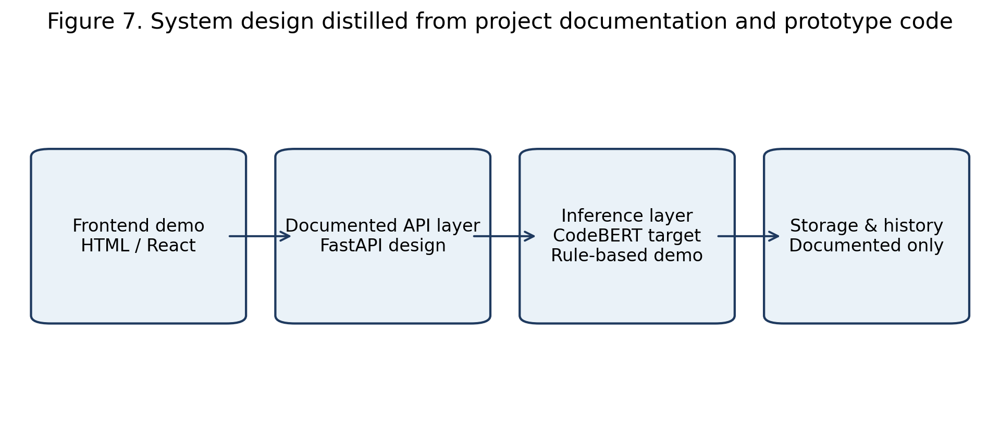
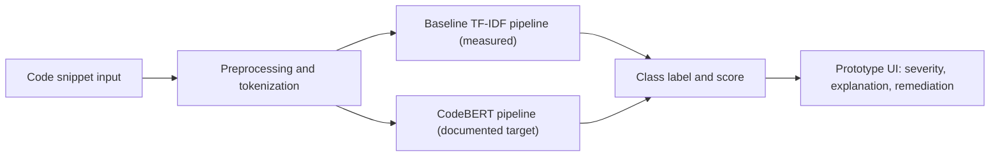
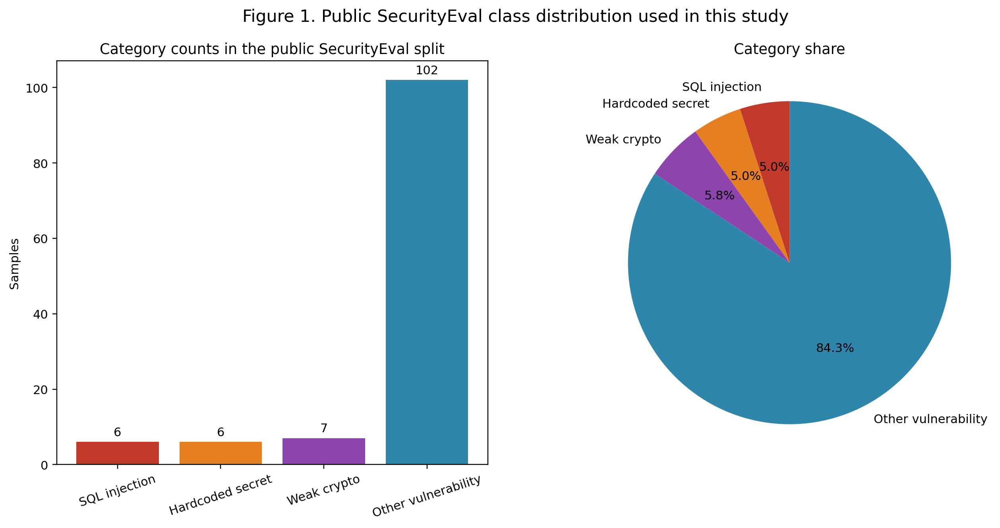
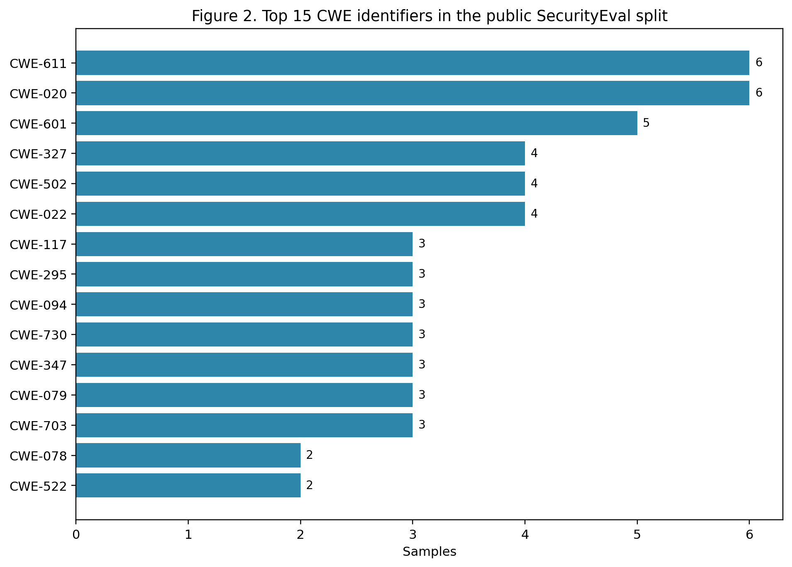
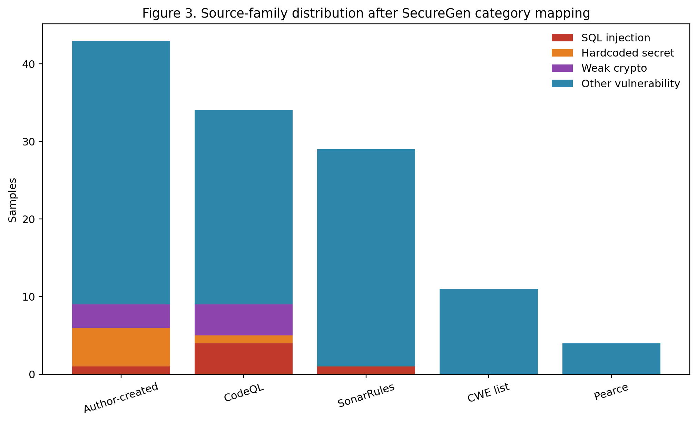
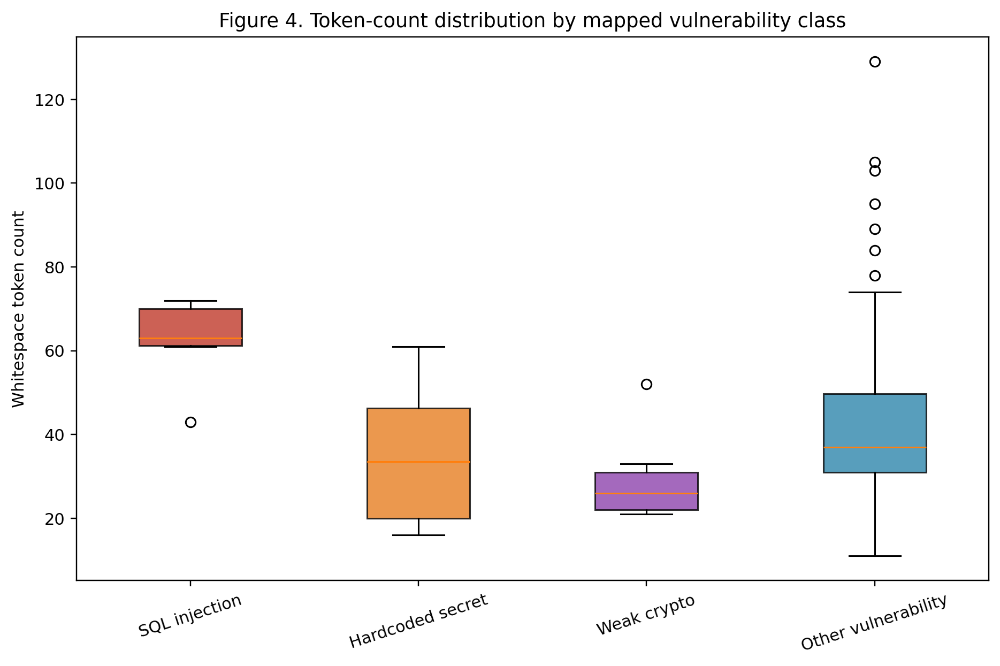
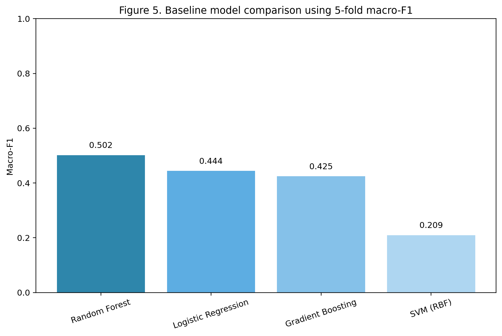
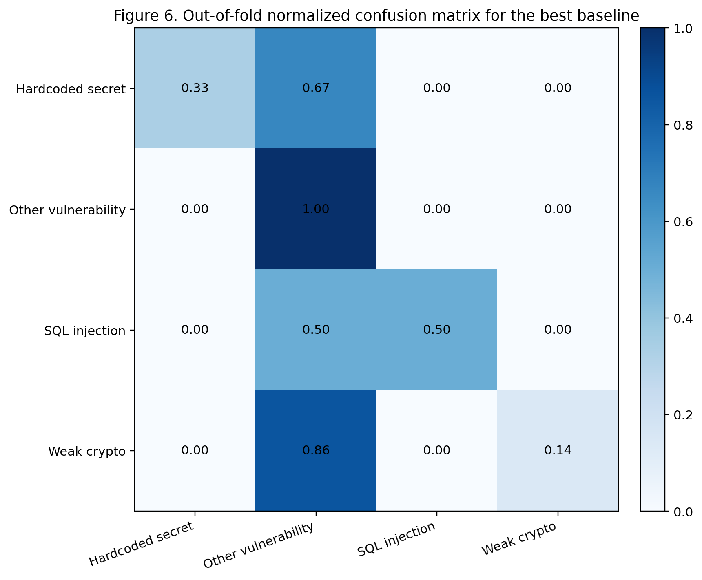

# SecureGen AI: An IMRED Analysis of a Prototype for Detecting Insecure AI-Generated Code

# Abstract

SecureGen AI is a university project positioned at the intersection of artificial intelligence, deep learning, and cybersecurity. The repository combines project-planning documents, exploratory notebooks, benchmarking code, frontend prototype assets, and a research package focused on the problem of insecure AI-generated code. This article synthesizes all available project files and treats the repository itself as the source of evidence. The study centers on the SecurityEval benchmark described in the project documents as a 130-prompt, 75-CWE benchmark [4], while the reproducible public split accessed by the notebooks contains 121 insecure Python samples. Using the notebook code as implemented, the dataset was mapped into four classes: `sql_injection`, `hardcoded_secret`, `weak_crypto`, and `other_vuln`. The reproducible split was highly imbalanced, with 102 of 121 samples (84.30%) assigned to `other_vuln`, while the three focal classes together comprised only 19 samples. Five-fold stratified cross-validation on TF-IDF plus structural features showed that the best measured baseline in the repository was Random Forest, which achieved accuracy 0.893, macro-precision 0.522, macro-recall 0.500, macro-F1 0.502, and one-vs-rest ROC-AUC 0.880. The repository also documents a CodeBERT-based target architecture, but no trained checkpoint, stored notebook outputs, or executed deep-learning metrics are present; therefore, CodeBERT performance is not reported as an empirical finding. The resulting evidence supports SecureGen AI as a credible prototype and educational case study, while also revealing a substantial gap between the documented product vision and the measured results currently reproducible from the repository.

# 1. Introduction

AI-assisted programming systems such as GitHub Copilot, Amazon CodeWhisperer, and Tabnine have made code generation a routine part of software development, but their usefulness is coupled with a security problem that is central to SecureGen AI. The repository frames this problem through prior work showing that AI coding systems can emit code that is syntactically plausible yet vulnerable, especially for injection flaws, credential exposure, and weak cryptographic choices [4], [5]. Within this project, SecureGen AI is presented as a response to that risk: a system intended to detect insecure patterns in AI-generated code, explain why a snippet is risky, and suggest a safer remediation path.

The project matters for both AI and cybersecurity because vulnerability detection in generated code is not a purely symbolic or purely statistical task. Lexical cues such as `md5` or embedded API keys can be strong indicators, but many insecure patterns depend on context, data flow, and API usage. This motivates the repository's reliance on deep-learning concepts, especially transformer-based encoders derived from BERT and CodeBERT [1]-[3]. In that sense, SecureGen AI is not only a secure-coding tool concept; it is also a case study in how representation learning can be applied to software security analysis.

The research objective reconstructed from the project files is twofold. First, the project aims to create a four-class view of SecurityEval that can support manageable academic experimentation. Second, it aims to turn that classifier into a prototype user-facing product with explainability and remediation support. The repository includes notebooks, reports, architecture descriptions, HTML and React interfaces, and a research package. However, because these materials mix design targets with executable artifacts, the present article deliberately separates reported evidence from aspirational project claims.

The repository scan preceding this article identified the following source corpus:

- Notebooks (2): `notebooks/lab2_eda_notebook.ipynb`, `notebooks/lab3_benchmark_notebook.ipynb`
- Markdown files (11): `docs/labs/lab1/architecture-diagram.md`, `docs/labs/lab1/project-plan.md`, `docs/labs/lab2/eda-report.md`, `docs/labs/lab3/benchmark-report.md`, `docs/labs/lab4/product-documentation.md`, `README.md`, `research_package/mini_article.md`, `research_package/presentation_brief.md`, `research_package/presentation_outline.md`, `research_package/README.md`, `research_package/references.md`
- Dataset files (0): none committed; the notebooks load `s2e-lab/SecurityEval` remotely from Hugging Face.
- Existing graphs/images (0): none committed before this article build.
- Source-code files (5): `demo/landing-page.html`, `index.html`, `notebooks/lab2_eda_notebook.py`, `notebooks/lab3_benchmark_notebook.py`, `src/SecureGenAIDemo.jsx`
- Experiment outputs (4): `docs/labs/lab2/eda-report.md`, `docs/labs/lab3/benchmark-report.md`, `notebooks/lab3_benchmark_notebook.ipynb`, `notebooks/lab3_benchmark_notebook.py`
- Reference files (1): `research_package/references.md`

# 2. Methods

## 2.1 Repository-Grounded Study Design

This article was built from a full scan of the repository, with notebooks, Markdown reports, source code, documentation, and the existing planning `.docx` treated as the source of truth. Notebook code was executed only where the repository contained runnable logic and dependencies. Claims present only as narrative expectations were retained as project intentions but not re-labeled as empirical findings.

Table 1 summarizes how the main repository components contributed to the reconstruction.

| Repository component | Evidence from files | Role in the study |
| --- | --- | --- |
| Lab planning documents | `docs/labs/lab1/project-plan.md`, `docs/labs/lab1/architecture-diagram.md`, `docs/labs/lab1/SecureGen_Plan_Report.docx` | Define project scope, planned architecture, objectives, and risks. |
| EDA assets | `docs/labs/lab2/eda-report.md`, `notebooks/lab2_eda_notebook.ipynb`, `notebooks/lab2_eda_notebook.py` | Describe dataset mapping, cleaning logic, and exploratory plots. |
| Benchmarking assets | `docs/labs/lab3/benchmark-report.md`, `notebooks/lab3_benchmark_notebook.ipynb`, `notebooks/lab3_benchmark_notebook.py` | Specify baseline evaluation code and CodeBERT training scaffold. |
| Product assets | `docs/labs/lab4/product-documentation.md`, `index.html`, `demo/landing-page.html`, `src/SecureGenAIDemo.jsx` | Document and implement the frontend prototype and user workflow. |
| Research package | `research_package/mini_article.md`, `presentation_brief.md`, `presentation_outline.md`, `references.md`, `README.md` | Supply narrative framing, presentation guidance, and the project reference list. |

## 2.2 Dataset and Label Mapping

The notebooks load the public Hugging Face dataset `s2e-lab/SecurityEval`, which exposed a single `train` split with 121 rows and the fields `ID`, `Prompt`, and `Insecure_code` at the time of analysis. This differs from the broader benchmark framing repeated across the documentation, which describes SecurityEval as 130 Python prompts spanning 75 CWE types [4]. Rather than forcing those two counts into a single number, this article distinguishes between the documented benchmark definition and the reproducible public split.

The notebook mapping rules deterministically collapse individual CWE identifiers into four operational labels. SQL injection comprises CWE-089, CWE-090, and CWE-643; hardcoded secrets comprise CWE-798, CWE-259, CWE-321, and CWE-312; weak cryptography comprises CWE-327, CWE-328, CWE-326, CWE-916, and CWE-477; all remaining weaknesses are assigned to `other_vuln`. No committed dataset CSV or parquet file is present in the repository, so the remote Hugging Face split functions as the practical dataset source.

Table 2 reports the mapped class distribution used in this article.

| Class | Count in public split | Share (%) | Notes |
| --- | ---: | ---: | --- |
| `sql_injection` | 6 | 4.96 | Derived from CWE-089, CWE-090, and CWE-643. |
| `hardcoded_secret` | 6 | 4.96 | Derived from CWE-798, CWE-259, CWE-321, and CWE-312. |
| `weak_crypto` | 7 | 5.79 | Derived from CWE-327, CWE-328, CWE-326, CWE-916, and CWE-477. |
| `other_vuln` | 102 | 84.30 | Residual class covering all remaining mapped weaknesses. |

## 2.3 Preprocessing and Exploratory Analysis

The EDA notebook and notebook-style Python script apply straightforward preprocessing. After loading the dataset, each sample identifier is parsed to extract its CWE identifier and source family. Source tags are normalized into `CodeQL`, `SonarRules`, `Pearce`, `CWE list`, and `Author-created`. Two lightweight structural features are then engineered from each insecure code snippet: whitespace token count (`num_tokens`) and line count (`num_lines`).

The repository's reported integrity checks were reproduced on the public split. Duplicate identifiers were absent, and missing values in the core prompt and code fields were not observed. The notebooks define exploratory plots for class balance, CWE frequency, source distribution, token-length spread, benchmark overlays, and lexical PCA. However, the committed `.ipynb` files contain zero stored outputs; all visual evidence in this article was therefore generated afresh from the executable notebook logic and the available public split.

## 2.4 Model Benchmarking Procedure

The benchmarking notebook implements four classical baselines over TF-IDF features extracted from the insecure code field, augmented with `num_tokens` and `num_lines`. The evaluated models are Logistic Regression, Random Forest, SVM with an RBF kernel, and Gradient Boosting. The code uses five-fold stratified cross-validation, which is appropriate given the repository's own repeated acknowledgement that the benchmark is small and imbalanced.

The same notebook also documents a planned deep-learning pipeline built around `microsoft/codebert-base`, Hugging Face tokenization, sequence truncation to 128 tokens, a learning rate of `2e-5`, batch size 8, weight decay `0.01`, and epoch-level checkpointing. However, the repository contains no trained checkpoint, no saved trainer logs, no stored attention outputs, and no executed evaluation records for this stage. Consequently, the CodeBERT configuration is described here as documented methodology rather than as a reported experiment outcome.

## 2.5 Prototype and System Workflow

The product side of the repository consists of a static HTML demo (`index.html`), a marketing-style landing page (`demo/landing-page.html`), and a React component (`src/SecureGenAIDemo.jsx`). These files implement a rule-based frontend prototype that detects three focal risk families using regular-expression patterns, assigns a severity badge, produces a confidence display, highlights risky tokens, suggests a remediation snippet, and records a small analysis history in the browser. The Lab 1 architecture files additionally describe a broader four-tier system with a React frontend, FastAPI backend, model layer, Redis cache, and PostgreSQL storage, but backend source code is not committed.

Figure 7 presents a system design diagram distilled from the documented architecture and the executable prototype.



Figure 7. System design distilled from project documentation and prototype code.

The workflow can also be summarized in Mermaid form:



The main analysis pipeline reconstructed from the repository is shown below.

```text
Algorithm 1: SecureGen AI repository pipeline
Input: code snippet s
Output: vulnerability label y, explanatory output e, remediation r

1. Load SecurityEval benchmark metadata and four-class CWE mapping.
2. For each benchmark sample:
3.     extract CWE identifier and source family from sample ID
4.     map CWE to one of {sql_injection, hardcoded_secret, weak_crypto, other_vuln}
5.     compute auxiliary features: num_tokens, num_lines
6. Build TF-IDF representations from insecure code text.
7. Evaluate classical models with 5-fold stratified cross-validation.
8. Select the best measured baseline from macro-F1.
9. In the prototype UI, analyze a user snippet with rule-based detectors.
10. Return severity, label, highlighted tokens, and remediation guidance.
11. Treat CodeBERT configuration as documented future work unless a trained checkpoint and metrics are available.
```

# 3. Results

## 3.1 Reproducible Dataset Characteristics

The public SecurityEval split used by the repository notebooks contained 121 insecure Python samples, zero duplicate identifiers, zero missing prompt values, and zero missing insecure-code values. After four-class mapping, the dataset was dominated by `other_vuln` (102 samples, 84.30%), with minority counts of 6 SQL injection samples, 6 hardcoded secret samples, and 7 weak cryptography samples. This confirms that the empirical setting is extremely imbalanced.

The source-family distribution was also uneven. The largest source family was `Author-created` with 43 samples, followed by `CodeQL` with 34, `SonarRules` with 29, `CWE list` with 11, and `Pearce` with 4. The most frequent individual CWE identifiers in the public split were CWE-020 (6), CWE-611 (6), CWE-601 (5), CWE-022 (4), CWE-327 (4). These results indicate that the repository's practical dataset is both source-heterogeneous and heavily skewed toward the residual vulnerability class.



Figure 1. Public SecurityEval class distribution used in this study.



Figure 2. Top 15 CWE identifiers in the public SecurityEval split.



Figure 3. Source-family distribution after SecureGen category mapping.

Snippet length also varied by class. In the public split, SQL injection examples had the largest mean token count (62.33 tokens), while weak cryptography examples were the shortest on average (29.29 tokens). This supports the repository's use of token and line counts as auxiliary structural features, although these features alone are unlikely to resolve semantic overlap between classes.



Figure 4. Token-count distribution by mapped vulnerability class.

## 3.2 Measured Baseline Performance

Only the classical baseline stage of the benchmarking notebook was fully reproducible from the repository. Table 3 reports the measured five-fold mean scores obtained by executing the notebook logic against the public split.

| Model | Accuracy | Precision | Recall | Macro-F1 | ROC-AUC (OvR) |
| --- | ---: | ---: | ---: | ---: | ---: |
| Random Forest | 0.893 | 0.522 | 0.500 | 0.502 | 0.880 |
| Logistic Regression | 0.752 | 0.417 | 0.573 | 0.445 | 0.761 |
| Gradient Boosting | 0.827 | 0.445 | 0.430 | 0.425 | 0.854 |
| SVM (RBF) | 0.297 | 0.307 | 0.461 | 0.209 | 0.610 |

The best measured baseline was Random Forest, which reached macro-F1 0.502 and accuracy 0.893. Gradient Boosting and Logistic Regression produced lower macro-F1 values (0.425 and 0.445, respectively), while SVM with an RBF kernel performed worst under the current feature space and class imbalance. The gap between accuracy and macro-F1 is itself informative: high raw accuracy is partly driven by the prevalence of `other_vuln`, whereas macro-averaged scores penalize weak minority-class behavior more strongly.



Figure 5. Baseline model comparison using 5-fold macro-F1.

The normalized out-of-fold confusion matrix for the best baseline shows why the macro scores remain modest. `Other_vuln` is recognized strongly, but minority classes experience substantial confusion, particularly between `sql_injection` and the broader residual class. This behavior is consistent with a dataset in which only a handful of samples define the minority categories.



Figure 6. Out-of-fold normalized confusion matrix for the best baseline.

## 3.3 What Is Not Reported

Several outputs discussed in the repository are not empirically available in the committed files. The notebooks contain no stored graphs, confusion matrices, or trainer logs. No trained CodeBERT checkpoint is present. No executed attention heatmap is stored. No backend API source code is committed. No screenshots are included. For that reason, CodeBERT accuracy, macro-F1, loss curves, attention visualizations, and deployment-time latency are not reported here as measured results. The expected CodeBERT values shown in `docs/labs/lab3/benchmark-report.md` and `notebooks/lab3_benchmark_notebook.py` are treated as targets or illustrative placeholders rather than findings.

## 3.4 Prototype Output Behavior

Although the backend is not implemented in source form, the frontend prototype behavior is observable from `index.html` and `src/SecureGenAIDemo.jsx`. The prototype can classify pasted code into SQL injection, hardcoded secret, weak crypto, or a safe/default branch using pattern matching. It then produces a severity badge, confidence-style progress bar, highlighted risky tokens, a remediation panel, and a short history table. In other words, the prototype already demonstrates the intended user interaction loop even though the learned inference layer is not yet connected end-to-end.

# 4. Discussion

SecureGen AI has several strengths as an academic project. First, it is well grounded in current security concerns around AI-generated code and anchors itself in established literature on transformers, CodeBERT, SecurityEval, and vulnerability patterns [1]-[9]. Second, the repository covers the full project arc from planning and EDA through benchmarking, product framing, and presentation assets. Third, the executed baseline results show that the project is not merely conceptual; there is enough implemented experimentation to support a genuine empirical discussion.

At the same time, the repository exposes important limitations. The practical dataset is very small and extremely imbalanced, with only 19 samples across the three focal minority classes. That imbalance helps explain why the best measured macro-F1 remains near 0.50 even though accuracy is much higher. In this setting, model reliability is limited, especially for minority-class recall. A model could appear successful by over-predicting `other_vuln`, which would be unacceptable for security triage where missed SQL injection or secret leakage events are costly.

Explainability is also only partially realized. The project documentation repeatedly emphasizes attention-based token highlighting, and the prototype includes rule-based token highlighting in the UI. However, a true learned explanation based on a trained CodeBERT checkpoint is not available in the committed artifacts. Therefore, the explainability story is stronger at the design level than at the empirical level. This is not a failure of the project so much as an indication that the repository presently represents a prototype and research scaffold rather than a finished model-driven system.

From a false-positive and false-negative perspective, the most concerning risk is false negatives. A prototype that fails to detect a minority-class vulnerability may give developers misplaced confidence in AI-generated code. False positives are also problematic because they reduce usability, but they can usually be reviewed manually. The measured baseline scores suggest that minority-class misses remain plausible. This concern is heightened by adversarial evasion possibilities mentioned in the project materials: query obfuscation, encoded secrets, uncommon cryptographic APIs, and distribution shift across languages or frameworks. Because the executable detector in the frontend is rule-based, it is especially susceptible to superficial evasion through small lexical changes.

There is also a clear production-versus-prototype gap. The architecture documents describe FastAPI, Redis, PostgreSQL, and a fine-tuned CodeBERT inference layer, yet the committed implementation is currently a browser-based prototype plus notebook experimentation. That is entirely appropriate for a university project, but the difference should be stated plainly. The current repository demonstrates a convincing concept, exploratory analysis, and benchmark scaffolding; it does not yet demonstrate a deployed ML security service.

Ethically, the project is well motivated because it positions SecureGen AI as a defensive aid rather than an automated authority. This is the right framing. In secure software development, such a tool should complement human review, secure coding guidance, and conventional static analysis rather than replace them. The repository's emphasis on remediation guidance and educational interfaces is therefore a strength, particularly for teaching contexts.

# Conclusion

SecureGen AI makes a meaningful contribution as a repository-level case study on detecting insecure AI-generated code. Across its planning documents, exploratory notebooks, benchmark code, prototype frontend, and research package, the project articulates a coherent vision: map SecurityEval into actionable vulnerability classes, use modern ML to classify insecure code, and surface the result through an explainable user interface. The reproducible evidence gathered from the repository confirms that the public split is small, imbalanced, and difficult, and that the best measured baseline under the current notebook implementation is Random Forest with macro-F1 0.502. At the same time, the repository does not yet contain empirical CodeBERT results, stored notebook outputs, or an implemented backend service, so those elements remain future work rather than reported findings.

The most useful next steps are therefore concrete and measurable: train and save the CodeBERT checkpoint referenced in the notebook, commit real evaluation artifacts such as loss curves and attention heatmaps, expand the dataset or label strategy to reduce class imbalance, and replace the current rule-based demo logic with the learned inference pipeline described in the architecture. If those steps are completed, SecureGen AI could move from a strong educational prototype toward a more convincing secure-AI coding assistant for research and applied software engineering.

# References

[1] A. Vaswani, N. Shazeer, N. Parmar, J. Uszkoreit, L. Jones, A. N. Gomez, L. Kaiser, and I. Polosukhin, "Attention Is All You Need," in *Advances in Neural Information Processing Systems 30*, 2017. [Online]. Available: https://arxiv.org/abs/1706.03762

[2] J. Devlin, M.-W. Chang, K. Lee, and K. Toutanova, "BERT: Pre-training of Deep Bidirectional Transformers for Language Understanding," 2018. [Online]. Available: https://arxiv.org/abs/1810.04805

[3] Z. Feng et al., "CodeBERT: A Pre-Trained Model for Programming and Natural Languages," in *Findings of the Association for Computational Linguistics: EMNLP 2020*, pp. 1536-1547, 2020. doi: 10.18653/v1/2020.findings-emnlp.139. [Online]. Available: https://aclanthology.org/2020.findings-emnlp.139/

[4] M. L. Siddiq and J. C. S. Santos, "SecurityEval Dataset: Mining Vulnerability Examples to Evaluate Machine Learning-Based Code Generation Techniques," in *Proceedings of MSR4P&S 2022*, 2022. doi: 10.1145/3549035.3561184. [Online]. Available: https://dl.acm.org/doi/10.1145/3549035.3561184

[5] H. Pearce, B. Ahmad, B. Tan, B. Dolan-Gavitt, and R. Karri, "Asleep at the Keyboard? Assessing the Security of GitHub Copilot's Code Contributions," in *2022 IEEE Symposium on Security and Privacy (SP)*, pp. 754-768, 2022. doi: 10.1109/SP46214.2022.9833571. [Online]. Available: https://ieeexplore.ieee.org/document/9833571

[6] OWASP Foundation, "OWASP Top 10: 2021," 2021. [Online]. Available: https://owasp.org/Top10/2021/

[7] MITRE, "CWE-89: Improper Neutralization of Special Elements used in an SQL Command ('SQL Injection')," 2026. [Online]. Available: https://cwe.mitre.org/data/definitions/89.html

[8] MITRE, "CWE-798: Use of Hard-coded Credentials," 2026. [Online]. Available: https://cwe.mitre.org/data/definitions/798.html

[9] MITRE, "CWE-327: Use of a Broken or Risky Cryptographic Algorithm," 2026. [Online]. Available: https://cwe.mitre.org/data/definitions/327.html
